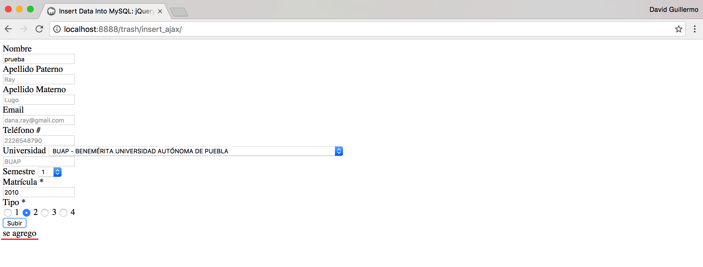

# INSERT SQL AJAX PHP

#Descripción
Insertar en una base de datos de MySQL a través de un script en PHP haciendo uso de AJAX para que no cambie de página.

Tenemos los siguientes archivos:
*conexion.php
*index.php
*insert.php
*my_script.php

