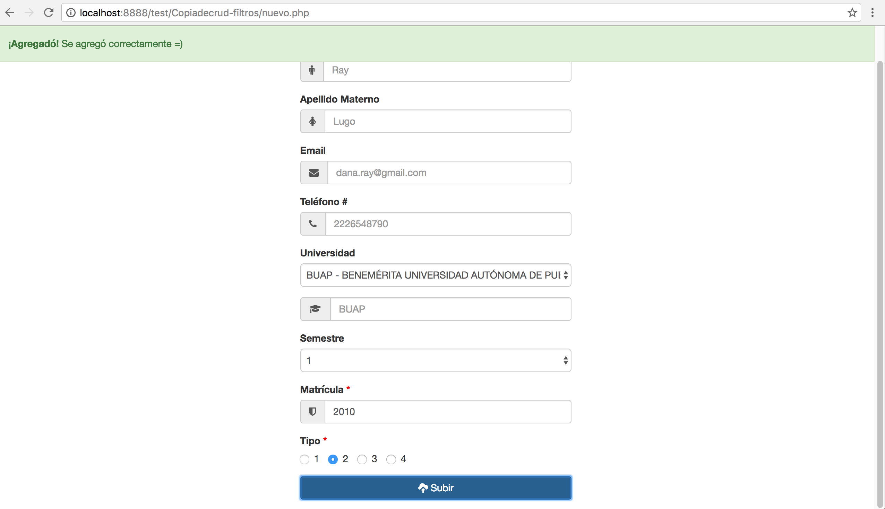

# Alert Boostrap Dissmised

##Descripción
Esta alerta se hace con CSS en conjunto con Javascript y las funcionalidades que trae Boostrap por defecto.

##Boostrap
	
	

		<strong>¡Agregadó!</strong> Se agregó correctamente =)
	

	
Notar que 'display:none' la oculta hasta que la función de Javascript es ejecutada.

##CSS
	

Ponemos `z-index` para que este sobre todos los elementos, `top: 0px` para que esté arriba de la ventana, `width: 100%` para que ocupe todo el ancho de la ventana y por último ponemos `position:fixed` para cuando se haga SCROLL siga sobre todos los elementos en la misma posición y no suba o baje, manteniendo su lugar.

##Javascript

	$("#myAlert").fadeIn();

	setTimeout( function(){ 
		$('#myAlert').delay(800).fadeOut("slow", function () { $(this).remove(); });
	}  , 500 );

`myAlert` es el id que le pusimos al div, `fadeIn()` es una función que trae por defecto Boostrap la cual aprece lentamente. `setTimeout` es una función de Javascript que permite ejecutar una acción después de un tiempo en este caso después de medio segundo `500` y por ultimo `dalay` la desaparece lentamente. Estas tres lineas de código se meten después de ejecutar una función especifica.

